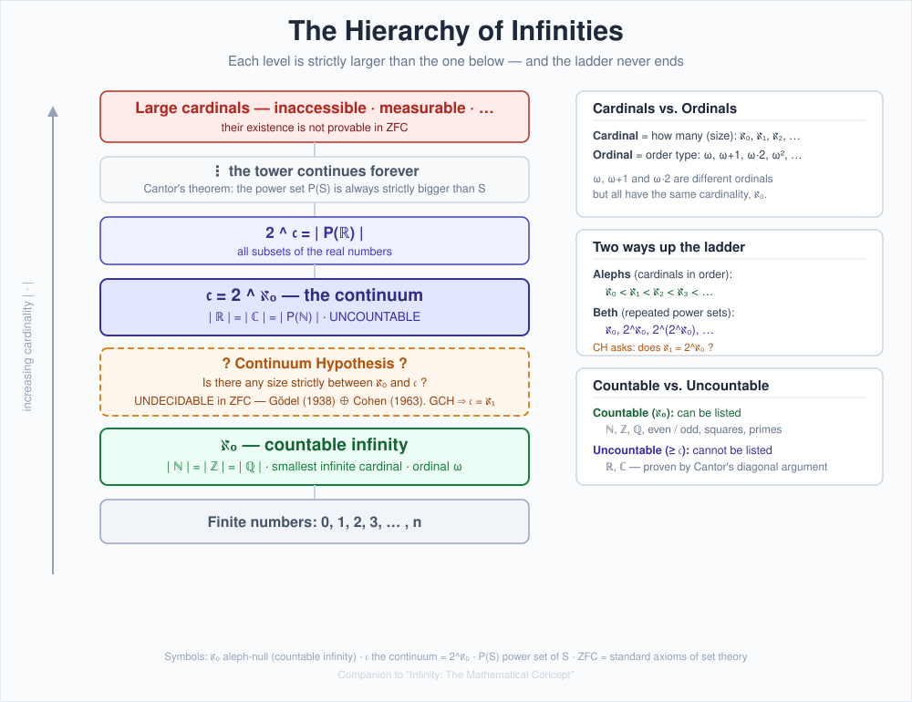

# Infinity: The Mathematical Concept — A Comprehensive Research Report

*Compiled June 2026. A survey of how mathematics has understood, formalized, and argued about the infinite — from Greek paradoxes to modern set theory, geometry, and physics.*

---

## 0. Executive Summary

Infinity (∞) is not a single idea but a family of related ones. Three threads run through its whole history:

1. **Potential vs. actual infinity.** Is the infinite only a process that never ends (counting, dividing), or a completed object you can hold in your hand (the *set* of all natural numbers)? The Greeks accepted the first and rejected the second; Cantor rehabilitated the second in the 1870s–80s and built modern mathematics on it.
2. **Sizes of infinity.** Cantor's deepest discovery is that not all infinities are equal. The integers and the real numbers are both infinite, but the reals are *strictly* more numerous. This gives an endless ladder of larger and larger infinities.
3. **The limits of proof.** The most natural question about infinite sizes — the Continuum Hypothesis — turns out to be *undecidable* from the standard axioms of mathematics. Gödel (1938) and Cohen (1963) proved you can neither prove nor disprove it. This is one of the most striking facts in all of mathematics.

Alongside the set-theoretic story, infinity appears as a *working tool*: limits in calculus, a "point at infinity" in geometry, and divergent quantities in physics that signal a theory has been pushed past its domain of validity.

---

## 1. The Two Faces of Infinity: Potential vs. Actual

The single most important conceptual distinction in the history of infinity is **Aristotle's**, and it dominated thinking for roughly 2,000 years.

- **Potential infinity** is an unlimited *process* — an operation you can always repeat once more, but which is never finished. The natural numbers as "you can always add one," or a line you can always subdivide further. It is unlimited *in time* but never actually completed.
- **Actual (completed) infinity** is an infinite totality treated as a finished, existing object — the whole infinite collection, all at once.

Aristotle accepted potential infinity as legitimate but **rejected actual infinity** as incoherent. This let him answer Zeno: a runner crossing a track passes through only a *potential* infinity of subintervals, not an actual one, and "the sum of a potential infinity is a finite number at any time," so the task is completable in finite time. ([Stanford Encyclopedia — Zeno's Paradoxes](https://plato.stanford.edu/entries/paradox-zeno/), [McGill — Zeno's Paradoxes](https://www.math.mcgill.ca/rags/JAC/124/Zenos_Paradoxes.pdf))

This distinction never fully went away. It is the philosophical seed of modern **finitism** and **constructivism**, which still reject completed infinities (see §9).

---

## 2. Greek Origins: Zeno's Paradoxes

In the 5th century BCE, **Zeno of Elea** devised his paradoxes to defend his teacher **Parmenides**, who held that change and motion are illusions and reality is a single unchanging whole. The paradoxes were weapons against the *plurality and motion* that common sense takes for granted. ([IEP — Zeno's Paradoxes](https://iep.utm.edu/zenos-paradoxes/), [Wikipedia — Zeno's paradoxes](https://en.wikipedia.org/wiki/Zeno%27s_paradoxes))

The famous motion paradoxes:

- **Achilles and the Tortoise.** Swift Achilles can never overtake a tortoise given a head start: each time he reaches where the tortoise *was*, it has moved a little further. The gap can be subdivided infinitely, so catching up seems to demand infinitely many steps.
- **The Dichotomy.** Before you can travel a distance, you must travel half of it; before that, a quarter; and so on. There is no *first* step to take, and infinitely many steps to complete.
- **The Arrow.** At any single instant, a flying arrow occupies a space exactly equal to itself and is therefore motionless. If it is motionless at every instant, how does it move at all?

**The modern resolution** comes from the theory of limits and convergent series (Newton, Leibniz, and the rigorous 19th-century arithmetization by Cauchy and Weierstrass). The infinite sum of distances in the Dichotomy is a **convergent geometric series** — 1/2 + 1/4 + 1/8 + ⋯ = 1 — so infinitely many shrinking intervals can have a *finite* total length and be traversed in finite time. ([Math McGill PDF](https://www.math.mcgill.ca/rags/JAC/124/Zenos_Paradoxes.pdf)) Note: limits resolve the *quantitative* paradox; philosophers still debate whether they fully dissolve the *conceptual* puzzle of completing a "supertask."

---

## 3. Galileo's Paradox (1638): The First Crack in "the Whole is Greater than the Part"

In *Two New Sciences* (1638), **Galileo** noticed something that should have been impossible. Consider the perfect squares: 1, 4, 9, 16, 25, …. On one hand, squares are *rarer and rarer* among the integers — clearly there are "more" whole numbers than squares. On the other hand, **every** number has exactly one square and **every** square comes from exactly one number, so they pair up perfectly with no leftovers: ([Wikipedia — Galileo's paradox](https://en.wikipedia.org/wiki/Galileo%27s_paradox))

```
 1    2    3    4    5    6  ...   (natural numbers)
 ↓    ↓    ↓    ↓    ↓    ↓
 1    4    9   16   25   36  ...   (their squares)
```

So are there more numbers than squares, or exactly as many? Galileo concluded that the relations "less than," "equal to," and "greater than" **simply do not apply to infinite quantities** — a cautious, almost defeated verdict.

He had stumbled onto the precise mechanism Cantor would later use to *define* infinite size: a one-to-one correspondence. Galileo saw the phenomenon but lacked the nerve to make it a definition. (Bernard **Bolzano**, in *Paradoxes of the Infinite*, 1851, pushed further toward accepting completed infinities but still resisted using bijection as the measure of size.)

---

## 4. Cantor's Revolution: Infinity Made Rigorous

Between roughly 1874 and 1897, **Georg Cantor** created **set theory** and, with it, the modern mathematics of the infinite. His decisive move was to take Galileo's pairing seriously and turn it into a definition. ([Britannica — Transfinite number](https://www.britannica.com/science/transfinite-number))

### 4.1 The definition of "same size"

Two sets have the **same cardinality** (same size) if and only if there is a **bijection** (a one-to-one, onto pairing) between them. No counting required — just matching. Under this definition:

- The naturals, the even numbers, the integers, the squares, and even the rational numbers (all fractions!) **all have the same size.** They are *countably infinite*.
- A set is **countable** if it can be put in bijection with the natural numbers {1, 2, 3, …} — i.e., its elements can be listed in a sequence (possibly never-ending).

Accepting this means embracing the seemingly absurd: **an infinite set can be the same size as a proper part of itself.** Far from a contradiction, this is now taken as the very *definition* of being infinite (Dedekind's definition).

### 4.2 The diagonal argument: not all infinities are equal

Cantor's masterstroke (1891) was to prove that the **real numbers are uncountable** — strictly more numerous than the naturals. Suppose you *could* list all real numbers between 0 and 1 in a sequence. Cantor builds a brand-new number by going down the diagonal of that list and *changing each digit*. The result differs from the 1st listed number in its 1st digit, from the 2nd in its 2nd digit, and so on — so it cannot be anywhere on the list. The assumption that a complete list exists collapses. ([Quanta / Banach–Tarski coverage](https://www.quantamagazine.org/how-a-mathematical-paradox-allows-infinite-cloning-20210826/))

The reals are *so densely packed that between any two of them there is always another*, and they resist being enumerated. ([Quanta](https://www.quantamagazine.org/how-a-mathematical-paradox-allows-infinite-cloning-20210826/)) The **continuum** (the size of ℝ) is denoted **𝔠** (or 2^ℵ₀).

### 4.3 Cantor's theorem: an endless ladder

The diagonal idea generalizes. **Cantor's theorem**: for *any* set S, its **power set** (the set of all subsets of S) is strictly larger than S itself. Applied over and over, this generates an **unending hierarchy of ever-larger infinities** — there is no biggest infinity. (Trying to form "the set of everything" leads to **Cantor's paradox**, one of the antinomies that forced set theory to be axiomatized.)

---

## 5. Transfinite Numbers: Cardinals, Ordinals, and the Alephs

Cantor introduced **transfinite numbers** — genuine numbers that are infinite — in two distinct flavors. The distinction between them is subtle and is the source of much confusion. ([Britannica — Transfinite number](https://www.britannica.com/science/transfinite-number), [Cantor's Attic — Aleph numbers](https://neugierde.github.io/cantors-attic/Aleph))

### 5.1 Cardinal numbers — *how many*

Cardinals measure **size** (cardinality). The infinite cardinals are the **aleph numbers**:

- **ℵ₀ (aleph-null / aleph-zero)** — the smallest infinite cardinal, the size of the natural numbers, i.e. countable infinity. ([Britannica — Transfinite number](https://www.britannica.com/science/transfinite-number))
- **ℵ₁** — the next-largest cardinal after ℵ₀, then **ℵ₂, ℵ₃, …**, and on through **ℵ_α** indexed by the ordinals.
- The whole **ℵ_α hierarchy is defined by transfinite recursion**, with ℵ₀ smallest and ℵ_α the α-th infinite cardinal. ([Cantor's Attic](https://neugierde.github.io/cantors-attic/Aleph))

### 5.2 Ordinal numbers — *in what order*

Ordinals measure the **order type** of a **well-ordered set** (one in which every nonempty subset has a least element). They generalize "1st, 2nd, 3rd, …" past the finite. ([NYU lecture notes — Cantor's Ordinals and Cardinals](https://research.engineering.nyu.edu/~jbain/Cat/lectures/07.OrdsandCards.pdf))

- The smallest infinite ordinal is **ω** (omega), the order type of 0, 1, 2, 3, …
- After ω comes **ω+1, ω+2, …**, then **ω·2, … ω², … ω^ω, …** — an intricate tower.

### 5.3 Why cardinals and ordinals differ

Here is the crucial point: **ω, ω+1, and ω·2 are all *different ordinals* but all have the *same cardinality* (ℵ₀).** Rearranging a countable set into a different order changes its order type (ordinal) but not its size (cardinal). Cardinal arithmetic is "absorbing" — ℵ₀ + 1 = ℵ₀, ℵ₀ + ℵ₀ = ℵ₀, ℵ₀ × ℵ₀ = ℵ₀ — whereas ordinal arithmetic is **non-commutative**: 1 + ω = ω but ω + 1 ≠ ω. The aleph cardinals are formally defined as the cardinalities of the **initial ordinals** (the least ordinal of each new size).

### 5.4 The hierarchy at a glance

The diagram below (`infinity_hierarchy.svg`) shows the whole ladder: finite numbers at the bottom, then countable infinity ℵ₀, the undecidable Continuum-Hypothesis gap, the continuum 𝔠 = 2^ℵ₀, the unending power-set tower above it, and large cardinals beyond ZFC at the top — with side panels on cardinals vs. ordinals and countable vs. uncountable.



The same structure in text form:

```
        ┌─────────────────────────────────────────────┐
  ▲     │  Large cardinals (inaccessible, measurable…) │   not provable in ZFC
  │     ├─────────────────────────────────────────────┤
  │     │  ⋮  power-set tower, forever                 │   |P(S)| > |S| always
  │     ├─────────────────────────────────────────────┤
  │     │  2^𝔠  = |P(ℝ)|                               │
in-     ├─────────────────────────────────────────────┤
crea-   │  𝔠 = 2^ℵ₀  — the continuum  |ℝ|=|ℂ|          │   UNCOUNTABLE
sing    ├─ ─ ─ ─ ─ ─ ─ ─ ─ ─ ─ ─ ─ ─ ─ ─ ─ ─ ─ ─ ─ ─ ─┤
size    │  ? Continuum Hypothesis ?  any size between? │   UNDECIDABLE in ZFC
  │     │  Gödel 1938 ⊕ Cohen 1963.   GCH ⇒ 𝔠 = ℵ₁     │   (Gödel ⊕ Cohen)
  │     ├─────────────────────────────────────────────┤
  │     │  ℵ₀ — countable  |ℕ|=|ℤ|=|ℚ|  (ordinal ω)    │   COUNTABLE
  │     ├─────────────────────────────────────────────┤
  │     │  Finite:  0, 1, 2, 3, … , n                  │
        └─────────────────────────────────────────────┘

  Two ladders up:   Alephs (cardinals in order)  ℵ₀ < ℵ₁ < ℵ₂ < …
                    Beth   (repeated power sets)  ℵ₀, 2^ℵ₀, 2^(2^ℵ₀), …
                    CH  ⇔  ℵ₁ = 2^ℵ₀
```

---

## 6. The Continuum Hypothesis: A Question Mathematics Cannot Answer

### 6.1 The question

Cantor proved ℵ₀ < 𝔠 (the reals are bigger than the naturals). The obvious next question: **is there any size strictly between them?** The **Continuum Hypothesis (CH)** says **no** — there is no set larger than the naturals but smaller than the reals; formally **𝔠 = ℵ₁** (the continuum is the *very next* cardinal after ℵ₀). The **Generalized CH (GCH)** extends this to every infinite cardinal: between an infinite set and its power set, no intermediate size exists. ([Wikipedia — Continuum hypothesis](https://en.wikipedia.org/wiki/Continuum_hypothesis), [Britannica — Transfinite number](https://www.britannica.com/science/transfinite-number))

CH was posed by **Cantor in 1878** and placed **first on David Hilbert's famous 1900 list of 23 problems**. ([Wikipedia — Continuum hypothesis](https://en.wikipedia.org/wiki/Continuum_hypothesis)) Cantor struggled with it for the rest of his life and never resolved it — because, as it turns out, *it cannot be resolved by ordinary means.*

### 6.2 The independence proof — one of the great results of the 20th century

The standard foundation of mathematics is **ZFC** (Zermelo–Fraenkel set theory with the Axiom of Choice). The shocking answer to CH is that **ZFC can neither prove nor disprove it.** CH is **independent** of ZFC. This was established in two halves: ([Stanford Encyclopedia — Independence and Large Cardinals](https://plato.stanford.edu/entries/independence-large-cardinals/))

- **Gödel (1938)** invented **inner models** — specifically the "constructible universe" **L**. He showed L satisfies ZFC *together with* CH. Consequence: **ZFC cannot disprove CH** (CH is consistent with ZFC).
- **Cohen (1963)** invented **forcing**, a method for building new set-theoretic models ("outer models") in which chosen statements hold. He produced a model of ZFC in which **CH fails**. Consequence: **ZFC cannot prove CH**.

Together: CH is undecidable in ZFC. Cohen's forcing technique won him the **Fields Medal** and reshaped all of set theory. (The full argument has since been **formally verified by computer proof assistants** — e.g., the Flypitch project formalized forcing and the unprovability of CH. ([arXiv — Formalization of forcing and unprovability of CH](https://arxiv.org/pdf/1904.10570)))

### 6.3 Can new axioms decide it? Gödel's Program and large cardinals

Gödel hoped that new, well-motivated axioms — especially **large cardinal axioms** (assertions that enormous, exotic infinite cardinals exist, far beyond anything ZFC guarantees) — might settle CH. This research program is still alive. But there's a catch: **Lévy and Solovay** showed that large cardinals are *preserved by forcing*, which means **large cardinal axioms by themselves cannot decide the size of the continuum** — Gödel acknowledged this in a 1966 postscript. ([Stanford Encyclopedia — Independence and Large Cardinals](https://plato.stanford.edu/entries/independence-large-cardinals/))

Other principles deeply connected to the large-cardinal hierarchy — **forcing axioms** (like Martin's Maximum) and **determinacy axioms** — go remarkably far in settling questions undecidable in ZFC, and some of them *do* bear on CH (often implying 𝔠 = ℵ₂). Whether there is a "right" answer to CH remains a genuine open *philosophical* question, not just a technical one. ([Stanford Encyclopedia — Independence and Large Cardinals](https://plato.stanford.edu/entries/independence-large-cardinals/))

---

## 7. Infinity as a Tool: Calculus and Analysis

Outside set theory, infinity is mostly a **manner of speaking** that the rigorous theory of **limits** makes precise. In standard analysis, "∞" is *not* a real number — you cannot do arithmetic with it freely. Instead:

- **lim f(x) = ∞** means f grows without bound (for every bound M, f eventually exceeds it) — a statement entirely about *finite* quantities.
- **lim_{x→∞} f(x) = L** means f approaches L as x grows without bound.
- Convergent infinite series assign a *finite* value to an infinite sum of terms — this is exactly what dissolves Zeno (§2).

### 7.1 The extended real line

For convenience analysts sometimes adjoin infinities to ℝ:

- The **affinely extended real line** adds **two** distinct points, **+∞ and −∞**, giving [−∞, +∞]. This respects order and is handy for limits, measure theory, and integration. ([Wikipedia — Projectively extended real line](https://en.wikipedia.org/wiki/Projectively_extended_real_number_system))
- The **projectively extended real line** R̂ adds a **single** point ∞ that is the neighbor of *both* ends of the line (it "wraps around" into a circle). This single point ∞ makes 1/0 = ∞ well-defined but **sacrifices the order relation** (you can't say ∞ is bigger or smaller than everything). ([Wikipedia — Projectively extended real line](https://en.wikipedia.org/wiki/Projectively_extended_real_number_system))

Both are conveniences with carefully limited arithmetic — expressions like ∞ − ∞ and 0 × ∞ remain **undefined** (indeterminate forms).

### 7.2 Infinitesimals and non-standard analysis

The early calculus of Newton and Leibniz used **infinitesimals** — quantities infinitely small yet nonzero. These were logically suspect (famously mocked by Bishop Berkeley as "ghosts of departed quantities") and were replaced by ε–δ limits in the 1800s. But in 1960 **Abraham Robinson's non-standard analysis** rehabilitated infinitesimals rigorously, using the **hyperreal numbers**, an ordered field containing both infinite and infinitesimal elements. So infinitesimals are now perfectly legitimate — just optional.

---

## 8. Points at Infinity: Geometry and Topology

Geometry handles infinity by *adding* it to the space as actual points, which often makes the geometry cleaner and more symmetric.

### 8.1 Projective geometry

In the **projective plane**, every pair of lines meets — even "parallel" ones, which meet at a **point at infinity**. All the points at infinity form a **line at infinity**. This removes the awkward exceptions of Euclidean geometry ("parallel lines never meet" becomes "parallel lines meet at infinity") and produces a beautiful **duality** between points and lines. Renaissance perspective painting — where parallel rails converge at a vanishing point on the horizon — is projective geometry made visible.

### 8.2 The Riemann sphere — the complex point at infinity

In complex analysis, the **Riemann sphere** is the complex plane **ℂ plus a single point at infinity**, ℂ ∪ {∞}, the **extended complex plane**. ([Wikipedia — Riemann sphere](https://en.wikipedia.org/wiki/Riemann_sphere)) Via **stereographic projection**, the flat plane is wrapped onto a sphere: the origin maps to the south pole and ∞ to the north pole. ([Wikipedia — Riemann sphere](https://en.wikipedia.org/wiki/Riemann_sphere), [Complex Analysis — Riemann sphere](https://complex-analysis.com/content/riemann_sphere.html)) On this sphere:

- ∞ becomes an *ordinary* point you can do analysis around — limits "at infinity" become limits at a normal point.
- Every **rational function extends to a holomorphic map on the sphere**, with its poles simply mapping to ∞. ([Wikipedia — Riemann sphere](https://en.wikipedia.org/wiki/Riemann_sphere))

The projectively extended real line is the 1-dimensional real analogue of the Riemann sphere — both add a *single* ∞. ([Wikipedia — Projectively extended real line](https://en.wikipedia.org/wiki/Projectively_extended_real_number_system))

### 8.3 Topology

Topology studies infinity through **compactness** (a precise sense of a space being "finite-like" / having no escape to infinity) and **compactification** — adding points at infinity to "close up" a space. The **one-point compactification** glues a single ∞ onto a space (the Riemann sphere is exactly the one-point compactification of ℂ). Topology also gives the cleanest modern statements of limits, continuity, and convergence — all of which are really statements about the infinite behavior of approximation.

---

## 9. Paradoxes of the Infinite

### 9.1 Hilbert's Grand Hotel — countable infinity is weird

Introduced by **David Hilbert in a 1924–25 lecture** and popularized by **George Gamow's 1947 book *One Two Three… Infinity***, the Grand Hotel has **infinitely many rooms, all occupied** — yet it can still take in more guests: ([Wikipedia — Hilbert's Grand Hotel](https://en.wikipedia.org/wiki/Hilbert%27s_paradox_of_the_Grand_Hotel), [Britannica — Infinite Hotel](https://www.britannica.com/science/Hilberts-paradox-of-the-Grand-Hotel))

- **One new guest:** move the guest in room *n* to room *n+1* for every *n*. Room 1 is now free. The full hotel absorbed another guest.
- **Infinitely many new guests:** move guest *n* to room *2n*, freeing all odd-numbered rooms — infinitely many vacancies.
- **Infinitely many buses, each with infinitely many guests:** a pairing trick (e.g. using prime powers or a diagonal enumeration) fits them all.

The "paradox" is just a vivid dramatization of the arithmetic ℵ₀ + 1 = ℵ₀ = ℵ₀ + ℵ₀ = ℵ₀ × ℵ₀. It illustrates the counterintuitive property that a *proper part* of a countable infinity can be matched with the whole. ([Wikipedia — Hilbert's Grand Hotel](https://en.wikipedia.org/wiki/Hilbert%27s_paradox_of_the_Grand_Hotel)) Crucially, the trick **fails for the reals** — you cannot enumerate an uncountable set of guests, so not every infinity is hospitable.

### 9.2 The Banach–Tarski Paradox — uncountable infinity is *really* weird

Devised by **Stefan Banach and Alfred Tarski in 1924** (the same year as Hilbert's Hotel), this theorem states: a **solid ball can be cut into a finite number of pieces (as few as five) and reassembled, using only rotations and translations, into *two* balls each identical to the original.** ([Quanta — Banach–Tarski](https://www.quantamagazine.org/how-a-mathematical-paradox-allows-infinite-cloning-20210826/))

The mechanism is "Hilbert's Hotel applied to geometry": the ball's **uncountably infinite set of points** is partitioned into **uncountably many countably-infinite sets**, and within each, a Hilbert-Hotel-style shift duplicates the structure. ([Quanta — Banach–Tarski](https://www.quantamagazine.org/how-a-mathematical-paradox-allows-infinite-cloning-20210826/)) The "pieces" are **non-measurable sets** — infinitely scattered point-clouds with no well-defined volume — so no physical matter or conservation law is violated; it is a statement about idealized point-sets, not cannonballs.

Banach–Tarski is the most dramatic consequence of the **Axiom of Choice** (§10), and is frequently cited *both* as a reason to be suspicious of Choice *and* as evidence that human intuition about volume simply does not extend to arbitrary infinite point-sets.

---

## 10. Foundations and Philosophy: How Much Infinity Should We Allow?

The acceptance of completed infinities is a *choice*, and not everyone makes it. The schools below disagree about which infinities (if any) are legitimate.

### 10.1 ZFC and the Axiom of Infinity

Mainstream mathematics works in **ZFC**. Crucially, the existence of *any* completed infinite set is not derivable — it has to be **postulated outright** as the **Axiom of Infinity**, which asserts that an infinite set (the naturals) exists. Everything Cantorian rests on this axiom. The **Axiom of Choice (AC)** — that from any collection of nonempty sets you can simultaneously pick one element from each — is the "C" in ZFC. It is indispensable for much of modern mathematics, but it produces counterintuitive results (Banach–Tarski; well-ordering of the reals) and was historically controversial. Gödel and Cohen also showed **AC is independent of ZF**.

### 10.2 Finitism

**Finitism** rejects actual/completed infinities entirely: only finite objects, constructible in finitely many steps from intuitive starting points (like the naturals), are mathematically real. Its lineage runs straight back to **Aristotle's rejection of actual infinity** in favor of a finite cosmos. ([Grokipedia — Finitism](https://grokipedia.com/page/Finitism), [Wikipedia — Finitism](https://en.wikipedia.org/wiki/Finitism)) **Hilbert's program** sought to ground all mathematics on a secure *finitary* base (though Hilbert himself defended Cantor's "paradise"); Gödel's incompleteness theorems showed that program could not fully succeed.

### 10.3 Intuitionism and constructivism

**Constructivism** holds that to assert a mathematical object *exists* you must be able to *construct* it; pure existence proofs (by contradiction, via the law of excluded middle) are rejected. The major schools: **intuitionism** (L. E. J. **Brouwer**, 1907), **predicativism** (Hermann **Weyl**, 1918), Skolem-style **finitism** (1923), and **Bishop-style constructivism** (Errett Bishop, 1967). ([Stanford Encyclopedia — Intuitionism](https://plato.stanford.edu/entries/intuitionism/)) Constructivists typically accept **potential** infinity (the naturals as an unfinished sequence) but are wary of **actual** infinity and of uncountable set theory.

### 10.4 Ultrafinitism

The most radical view. **Ultrafinitism** (a.k.a. ultraintuitionism) objects not only to infinite objects but even to **finite objects that are "too large"** to be physically realized or surveyed — e.g. it questions whether a number like 2^(2^100), which can never be written out or computed, "really" exists. It objects to the totality of functions like exponentiation over the naturals. ([Wikipedia — Ultrafinitism](https://en.wikipedia.org/wiki/Ultrafinitism)) Most mathematicians regard it as unworkably extreme, though it raises serious questions about feasibility and the gap between mathematical and physical existence. ([Wikipedia — Ultrafinitism](https://en.wikipedia.org/wiki/Ultrafinitism))

A useful way to see the spectrum: **ultrafinitism ⊂ finitism ⊂ constructivism ⊂ classical (ZFC) mathematics**, ordered by how much infinity each is willing to grant.

---

## 11. Infinity in Physics and Cosmology

Physics has a famously uneasy relationship with infinity. The dominant attitude among working physicists is that **infinities in a physical theory are red flags, not features of nature.**

### 11.1 Singularities

**General relativity predicts singularities** — points where curvature, density, or other physical quantities become **infinite** — at the **centers of black holes** and at the **Big Bang**. The standard interpretation is that these infinities signal **the breakdown of the theory**, i.e. that a piece of physics is missing (presumably quantum gravity), rather than that infinity is literally physically realized. ([APS Physics — Vanquishing infinity](https://physics.aps.org/articles/v2/70))

### 11.2 Renormalization and divergences

**Quantum field theory** is plagued by calculations that **diverge to infinity** — typically because elementary particles are treated as **pointlike**, producing short-distance ("ultraviolet") singularities. The technique of **renormalization** systematically subtracts these infinities and fixes the finite remainder by **measurement at some reference scale**, yielding the most accurately tested predictions in all of science. ([APS Physics — Vanquishing infinity](https://physics.aps.org/articles/v2/70), [Springer — regularization & renormalization in primordial observables](https://link.springer.com/article/10.1007/s40766-024-00053-0)) Many physicists read these infinities as **"a measure of our ignorance"** — a signpost that the theory needs improvement — rather than as facts about reality. ([arXiv — Infinities as a measure of our ignorance](https://arxiv.org/pdf/1305.2358))

### 11.3 An infinite universe?

Whether the **universe is spatially infinite** is observationally open. Some cosmological models (e.g. flat, eternal, or steady-state pictures) entail **infinitely many particles**; debate even reaches into *which* infinity — a merely countable infinity of particles, or something with the **power of the continuum**. ([sources via cosmology search](https://consensus.app/questions/infinity-in-cosmology/)) An infinite universe raises its own paradoxes (e.g. infinite repetition of every possible history, infinitely many copies of you). The honest scientific status: **unresolved.**

---

## 12. Key Distinctions Cheat-Sheet

| Distinction | One side | Other side |
|---|---|---|
| **Mode of existence** | Potential infinity (endless process) | Actual infinity (completed totality) |
| **Size of countable sets** | Countable: ℕ, ℤ, ℚ, squares (all ℵ₀) | Uncountable: ℝ, ℂ, power set of ℕ (𝔠 = 2^ℵ₀) |
| **Type of transfinite number** | Cardinal (size): ℵ₀, ℵ₁, … | Ordinal (order): ω, ω+1, ω², … |
| **Extended line** | Affine: two points ±∞ (keeps order) | Projective: one point ∞ (keeps division, loses order) |
| **Status of CH** | Consistent with ZFC (Gödel) | Not provable from ZFC (Cohen) → **independent** |
| **Philosophical stance** | Classical/ZFC (all infinities) | Constructivist → finitist → ultrafinitist (progressively fewer) |
| **Infinity in physics** | Useful intermediate (renormalization, limits) | Singularity = theory breakdown, not real |

---

## 13. Glossary

- **ℵ₀ (aleph-null):** the smallest infinite cardinal; size of ℕ; "countable infinity."
- **𝔠 (continuum):** the cardinality of the real numbers; equals 2^ℵ₀.
- **Cardinality:** the "size" of a set, measured by bijection.
- **Bijection:** a perfect one-to-one pairing between two sets.
- **Countable / Uncountable:** matchable / not matchable with ℕ.
- **Cardinal number:** measures size (how many).
- **Ordinal number:** measures order type of a well-ordered set.
- **ω (omega):** the smallest infinite ordinal.
- **Power set:** the set of all subsets of a set; always strictly larger (Cantor's theorem).
- **CH / GCH:** Continuum Hypothesis / its generalized form.
- **ZFC:** Zermelo–Fraenkel set theory + Axiom of Choice — the standard foundation.
- **Forcing:** Cohen's method for constructing set-theoretic models to prove independence.
- **Inner model / L:** Gödel's constructible universe, used to prove CH consistent.
- **Large cardinals:** axioms positing vast infinite cardinals beyond ZFC's reach.
- **Renormalization:** physics procedure for removing infinities from QFT calculations.
- **Singularity:** a point where a physical quantity becomes infinite (black hole, Big Bang).

---

## 14. Sources

History, paradoxes, and philosophy:
- [Stanford Encyclopedia of Philosophy — Zeno's Paradoxes](https://plato.stanford.edu/entries/paradox-zeno/)
- [Internet Encyclopedia of Philosophy — Zeno's Paradoxes](https://iep.utm.edu/zenos-paradoxes/)
- [Wikipedia — Zeno's paradoxes](https://en.wikipedia.org/wiki/Zeno%27s_paradoxes)
- [McGill University — Zeno's Paradoxes (PDF)](https://www.math.mcgill.ca/rags/JAC/124/Zenos_Paradoxes.pdf)
- [Wikipedia — Galileo's paradox](https://en.wikipedia.org/wiki/Galileo%27s_paradox)
- [Stanford Encyclopedia of Philosophy — Intuitionism in the Philosophy of Mathematics](https://plato.stanford.edu/entries/intuitionism/)
- [Wikipedia — Finitism](https://en.wikipedia.org/wiki/Finitism) · [Grokipedia — Finitism](https://grokipedia.com/page/Finitism)
- [Wikipedia — Ultrafinitism](https://en.wikipedia.org/wiki/Ultrafinitism)

Cantor, transfinite numbers, and the Continuum Hypothesis:
- [Britannica — Transfinite number](https://www.britannica.com/science/transfinite-number)
- [Britannica — Cardinal number](https://www.britannica.com/science/cardinal-number)
- [Cantor's Attic — The aleph numbers](https://neugierde.github.io/cantors-attic/Aleph)
- [NYU (J. Bain) — Cantor's Theory of Ordinal and Cardinal Numbers (PDF)](https://research.engineering.nyu.edu/~jbain/Cat/lectures/07.OrdsandCards.pdf)
- [Wikipedia — Continuum hypothesis](https://en.wikipedia.org/wiki/Continuum_hypothesis)
- [Stanford Encyclopedia of Philosophy — Independence and Large Cardinals](https://plato.stanford.edu/entries/independence-large-cardinals/)
- [arXiv — A formalization of forcing and the unprovability of the continuum hypothesis](https://arxiv.org/pdf/1904.10570)

Infinity as a tool — analysis, geometry, topology:
- [Wikipedia — Projectively extended real number system](https://en.wikipedia.org/wiki/Projectively_extended_real_number_system)
- [Wikipedia — Riemann sphere](https://en.wikipedia.org/wiki/Riemann_sphere)
- [Complex-analysis.com — The Riemann Sphere](https://complex-analysis.com/content/riemann_sphere.html)

Paradoxes of infinity:
- [Wikipedia — Hilbert's paradox of the Grand Hotel](https://en.wikipedia.org/wiki/Hilbert%27s_paradox_of_the_Grand_Hotel)
- [Britannica — Infinite Hotel Paradox](https://www.britannica.com/science/Hilberts-paradox-of-the-Grand-Hotel)
- [Quanta Magazine — Banach–Tarski and the Paradox of Infinite Cloning](https://www.quantamagazine.org/how-a-mathematical-paradox-allows-infinite-cloning-20210826/)

Infinity in physics and cosmology:
- [APS Physics — Vanquishing Infinity](https://physics.aps.org/articles/v2/70)
- [Springer — Regularization and renormalization of divergences in primordial observables](https://link.springer.com/article/10.1007/s40766-024-00053-0)
- [arXiv — Infinities as a measure of our ignorance](https://arxiv.org/pdf/1305.2358)

---

*Note on method: the original automated deep-research run was throttled by a transient API rate limit and returned no usable sources; this report was reconstructed via paced web searches across seven angles (history, set theory, foundations, analysis, geometry, paradoxes, physics) and synthesized with established mathematical knowledge. All claims are paraphrased; consult the linked primary and encyclopedic sources for full detail and proofs.*
